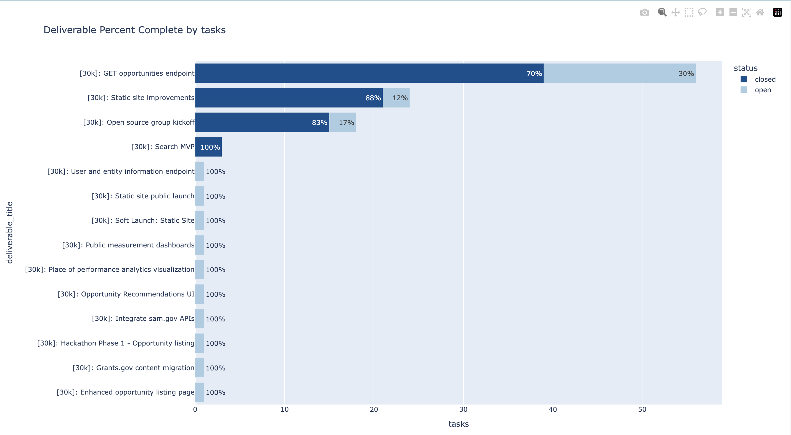

# Simpler Grants Analytics

This sub-directory enables users to run analytics on data generated within the Simpler Grants project.

## Getting Started

### Pre-requisites

- Python version 3.11
- Poetry
- GitHub CLI

Check that you have the following with: `make check-prereqs`

### Installation

1. Clone the GitHub repo: `git clone https://github.com/HHS/simpler-grants-gov.git`
2. Change directory into the analytics folder: `cd simpler-grants-gov/analytics`
4. Set up the project: `make setup` -- This will install the required packages and prompt you to authenticate with GitHub
5. Create a `.secrets.toml` with the following details:
   ```toml
   reporting_channel_id = "<REPLACE_WITH_CHANNEL_ID>"
   slack_bot_token = "<REPLACE_WITH_SLACKBOT_TOKEN_ID>"
   ```

## Getting started

### Learning how to use the command line tool

The `analytics` package comes with a built-in CLI that you can use to discover the reporting features available:

Start by simply typing `poetry run analytics --help` which will print out a list of available commands:


Discover the arguments required for a particular command by appending the `--help` flag to that command:

```bash
poetry run analytics export gh_issue_data --help
```


### Exporting GitHub data

After following the installation steps above, you can use the following commands to export data from GitHub for local analysis:

#### Exporting issue data

```bash
poetry run analytics export gh_issue_data --owner HHS --repo simpler-grants-gov --output-file data/issue-data.json
```

Let's break this down piece by piece:

- `poetry run` - Tells poetry to execute a package installed in the virtual environment
- `analytics` - The name of the analytics package installed locally
- `export gh_issue_data` - The specific sub-command in the analytics CLI we want to run
- `--owner HHS` Passing `HHS` to the `--owner` argument for this sub-command, the owner of the repo whose issue data we want to export, in this case `HHS`
- `--repo simpler-grants-gov` We want to export issue data from the `simpler-grants-gov` repo owned by `HHS`
- `--output-file data/issue-data.json` We want to write the exported data to the file with the relative path `data/issue-data.json`

#### Exporting project data

Exporting project data works almost the same way, except it expects a `--project` argument instead of a `--repo` argument. **NOTE:** The project should be the project number as it appears in the URL, not the name of the project.

```bash
poetry run analytics export gh_project_data --owner HHS --project 13 --output-file data/sprint-data.json
```

### Calculating metrics

#### Calculating sprint burndown

Once you've exported the sprint and issue data from GitHub, you can start calculating metrics. We'll begin with sprint burndown:

```bash
poetry run analytics calculate sprint_burndown --sprint-file data/sprint-data.json --issue-file data/issue-data.json --sprint "Sprint 10" --show-results
```

A couple of important notes about this command:

- `--sprint "Sprint 10"` In order to calculate burndown, you'll need to specify a sprint by name. We're currently working to add an option to use `@current` and other date-relative sprint flags
- `--show-results` In order to the see the output in a browser you'll need to pass this flag. 


You can also post the results of this metric to a Slack channel:

```bash
poetry run analytics calculate sprint_burndown --sprint-file data/sprint-data.json --issue-file data/issue-data.json --sprint "Sprint 10" --post-results
```

> **NOTE:** This requires you to have the `.secrets.toml` configured according to the directions in step 5 of the [installation section](#installation)


### Calculating deliverable percent complete

Another key metric you can report is the percentage of tasks or points completed per 30k deliverable. 
You can specify the unit you want to use for percent complete (e.g. points or tasks) using the `--unit` flag.

For example, here we're calculating percentage completion based on the number of tickets under each deliverable.

```bash
poetry run analytics calculate deliverable_percent_complete --sprint-file data/sprint-data.json --issue-file data/issue-data.json --show-results --unit tasks
```


And here we're calculating it based on the total story point value of those tickets.

```bash
poetry run analytics calculate deliverable_percent_complete --sprint-file data/sprint-data.json --issue-file data/issue-data.json --show-results --unit points
```


The `deliverable_pct_complete` sub-command also supports the `--post-results` flag if you want to post this data to slack.
